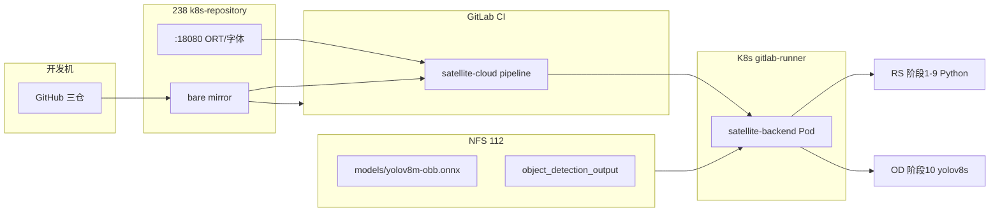

# 三项目文档索引与阅读指南

> **用途**：帮助你和同事在 **satellite-cloud**、**Satellite-Remote-Sensing**、**Object-Detection** 之间快速找到该读的文档，避免重复、遗漏或读错版本。  
> **仓库关系**：`satellite-cloud` 是编排与部署中心；RS / OD 是载荷算法仓，由 CI 打入 backend 镜像或在本地/WSL 联调。  
> **最后更新**：2026-06-17（Phase 0 归档 + Phase 1 启动）

---

## 1. 先选你的场景（30 秒定位）

| 我想… | 从这里开始 | 预计阅读 |
|--------|------------|----------|
| **了解整体是做什么的** | [satellite-cloud/README.md](../README.md) → [ARCHITECTURE.md](../ARCHITECTURE.md) | 20～40 分钟 |
| **在 K8s 跑通 RS + 检测 1～10 阶段** | [K8S_BASELINE_RUNBOOK.md](./K8S_BASELINE_RUNBOOK.md) **全文 + 附录 A** | 1 小时（操作另计） |
| **只维护/发布 satellite-cloud** | [REMOTE_SENSING_K8S_DEPLOYMENT.md](./REMOTE_SENSING_K8S_DEPLOYMENT.md) | 按需查阅 |
| **同步 GitHub → 内网 GitLab** | [REMOTE_SENSING_REPO_MIRROR.md](./REMOTE_SENSING_REPO_MIRROR.md) + [OBJECT_DETECTION_REPO_MIRROR.md](./OBJECT_DETECTION_REPO_MIRROR.md) | 15 分钟 |
| **本地 WSL 联调检测** | [Object-Detection/README.md](../../Object-Detection/README.md) | 30 分钟 |
| **本地 WSL 联调遥感脚本** | [Satellite-Remote-Sensing/README.md](../../Satellite-Remote-Sensing/README.md) | 30 分钟 |
| **阶段 10 很慢 / 像卡住** | [K8S_BASELINE_RUNBOOK.md](./K8S_BASELINE_RUNBOOK.md) §7.6、§8 | 5 分钟 |
| **CI 构建 ORT/字体失败** | [K8S_BASELINE_RUNBOOK.md](./K8S_BASELINE_RUNBOOK.md) §5.2、§8 | 10 分钟 |
| **记录 Phase 0 baseline / 收口** | [K8S_BASELINE_RUNBOOK.md](./K8S_BASELINE_RUNBOOK.md) **§11** / [archives/2026-06-17_phase0-closure.md](./archives/2026-06-17_phase0-closure.md) | 已闭合 |
| **Phase 1 Redis + rs-worker** | [PHASE1_RUNBOOK.md](./PHASE1_RUNBOOK.md) | 按手册执行 |
| **规划微服务 / 多星协同** | [MICROSERVICES_IMPLEMENTATION_PLAN.md](./MICROSERVICES_IMPLEMENTATION_PLAN.md) | 45 分钟 |
| **历史归档索引** | [archives/ARCHIVE_INDEX.md](./archives/ARCHIVE_INDEX.md) | 2 分钟 |
| **压到分钟级 / 性能优化** | [REMOTE_SENSING_MINUTE_LEVEL_ROADMAP.md](./REMOTE_SENSING_MINUTE_LEVEL_ROADMAP.md) | 30 分钟 |
| **从没有遥感的旧版迁移** | [REMOTE_SENSING_BASELINE_MIGRATION_RUNBOOK.md](./REMOTE_SENSING_BASELINE_MIGRATION_RUNBOOK.md) | 历史参考 |

---

## 2. 按角色推荐阅读顺序

### 2.1 新同事（第一次接触三仓）

```text
1. satellite-cloud/README.md          … 项目是什么
2. ARCHITECTURE.md                    … 拓扑、前后端、K8s 大图（偏早期设计，部分细节以 runbook 为准）
3. K8S_BASELINE_RUNBOOK.md 附录 A     … 当前集群「真实怎么跑」的摘要
4. Satellite-Remote-Sensing/README.md … 阶段 1～9 脚本做什么
5. Object-Detection/README.md         … yolov8s 做什么、如何本地编译
```

不必一开始读：`BRAINSTORM.md`、`QUESTIONS.md`、`PROJECT_SUMMARY.md`（偏立项记录）。

### 2.2 运维 / 发布（GitLab + K8s）

```text
1. K8S_BASELINE_RUNBOOK.md            … SSOT：部署、CI 变量、NFS、验收
2. REMOTE_SENSING_K8S_DEPLOYMENT.md     … Deployment 环境变量与挂载详解
3. REMOTE_SENSING_REPO_MIRROR.md        … RS 代码同步
4. OBJECT_DETECTION_REPO_MIRROR.md      … OD 代码同步
5. GITLAB_RUNNER_IMAGE_MIRROR.md        … CI Runner 镜像拉取失败时
6. CI_TOPOLOGY_NFS_SYNC.md              … 拓扑 CSV 同步（与 RS/OD 无关）
7. k8s/backend/TOPOLOGY_IMPORT.md       … 拓扑导入 Job
```

### 2.3 算法 / 载荷开发（RS 或 OD）

```text
RS 开发者:
  Satellite-Remote-Sensing/README.md
  Satellite-Remote-Sensing/K8S_RUNTIME_PREP.md

OD 开发者:
  Object-Detection/README.md
  Object-Detection/PROJECT_CONFIG.md    … 依赖版本、third_party、模型
  Object-Detection/K8S_RUNTIME_PREP.md
  satellite-cloud/backend/.env.example  … 本地 wsl-detection.cmd 联调
```

### 2.4 架构 / 答辩 / 第三方测试

```text
1. MICROSERVICES_IMPLEMENTATION_PLAN.md   … 目标架构、阶段 0～4、120 星规划
2. K8S_BASELINE_RUNBOOK.md 附录 A         … 已测基线 46m36s
3. REMOTE_SENSING_MINUTE_LEVEL_ROADMAP.md … 性能路线与量化验收
```

---

## 3. 文档分级（读前先看清层级）

| 级别 | 含义 | 读错后果 |
|------|------|----------|
| **L1 · SSOT** | 当前集群事实来源，与生产一致 | 低 |
| **L2 · 操作手册** | 分场景步骤，可能引用 L1 | 低 |
| **L3 · 模块参考** | 单仓库运行时、配置、脚本说明 | 中（版本需与 CI 对齐） |
| **L4 · 设计/历史** | 立项、 brainstorm、迁移旧路径 | 高（易过时） |

---

## 4. 三仓文档总表

路径以 monorepo 根 `pcl_satellite_project/` 为基准；若只 clone 单仓，按表中「所在仓库」打开即可。

### 4.1 satellite-cloud（19 篇 + 本索引）

#### L1 · 必读 / SSOT

| 文档 | 内容 | 谁该读 |
|------|------|--------|
| [docs/K8S_BASELINE_RUNBOOK.md](./K8S_BASELINE_RUNBOOK.md) | **Baseline 1～10 部署 SSOT**；仓库机 mirror、CI 变量、ORT 内网镜像、NFS 模型、附录 A 归档、**§11 Phase 0 收口 Checklist** | 所有人（运维优先） |
| [docs/MICROSERVICES_IMPLEMENTATION_PLAN.md](./MICROSERVICES_IMPLEMENTATION_PLAN.md) | 微服务拆分、Redis/Argo、120 星、阶段 0 已完成标记 | 架构、负责人 |

#### L2 · 部署与 CI/CD

| 文档 | 内容 | 与 L1 关系 |
|------|------|------------|
| [docs/REMOTE_SENSING_K8S_DEPLOYMENT.md](./REMOTE_SENSING_K8S_DEPLOYMENT.md) | satellite-cloud 侧 K8s/CI 细节：env、挂载、资源、§2.5 检测 | L1 的补充参数手册 |
| [docs/REMOTE_SENSING_REPO_MIRROR.md](./REMOTE_SENSING_REPO_MIRROR.md) | RS：GitHub → GitLab、Job Token | L1 §2.3 的 RS 专篇 |
| [docs/OBJECT_DETECTION_REPO_MIRROR.md](./OBJECT_DETECTION_REPO_MIRROR.md) | OD：GitHub → GitLab、Job Token | L1 §2.3 的 OD 专篇 |
| [docs/GITLAB_RUNNER_IMAGE_MIRROR.md](./GITLAB_RUNNER_IMAGE_MIRROR.md) | Runner/helper 镜像进 Harbor | CI 报 EOF 时 |
| [CI_TOPOLOGY_NFS_SYNC.md](../CI_TOPOLOGY_NFS_SYNC.md) | 拓扑 CSV → NFS → import Job | 拓扑功能专用 |
| [k8s/backend/TOPOLOGY_IMPORT.md](../k8s/backend/TOPOLOGY_IMPORT.md) | 拓扑导入 Job 说明 | 同上 |

#### L3 · 开发与参考

| 文档 | 内容 |
|------|------|
| [README.md](../README.md) | 项目介绍、技术栈、本地启动 |
| [ARCHITECTURE.md](../ARCHITECTURE.md) | 早期架构设计（宏观） |
| [backend/UPGRADE_GUIDE.md](../backend/UPGRADE_GUIDE.md) | 后端升级说明 |
| [backend/migrations/MIGRATIONS.md](../backend/migrations/MIGRATIONS.md) | 数据库迁移用法 |
| [backend/migrations/DB_SCHEMA.md](../backend/migrations/DB_SCHEMA.md) | 表结构说明 |
| [backend/.env.example](../backend/.env.example) | 本地 env（含 WSL RS/OD 路径） |
| [frontend/README.md](../frontend/README.md) | 前端说明 |
| [scripts/mirror_build_deps.sh](../scripts/mirror_build_deps.sh) | 下载 ORT/字体供内网 HTTP（见 L1 §5.2） |

#### L4 · 历史 / 规划 / 杂项

| 文档 | 内容 | 建议 |
|------|------|------|
| [docs/REMOTE_SENSING_BASELINE_MIGRATION_RUNBOOK.md](./REMOTE_SENSING_BASELINE_MIGRATION_RUNBOOK.md) | 从无 RS 能力迁移的旧手册 | 新集群优先用 L1 |
| [docs/REMOTE_SENSING_MINUTE_LEVEL_ROADMAP.md](./REMOTE_SENSING_MINUTE_LEVEL_ROADMAP.md) | 分钟级性能路线 | 优化阶段再读 |
| [PROJECT_SUMMARY.md](../PROJECT_SUMMARY.md) | 项目创建总结 | 了解历史即可 |
| [docs/BRAINSTORM.md](./BRAINSTORM.md) | 头脑风暴记录 | 可选 |
| [docs/QUESTIONS.md](./QUESTIONS.md) | 需求确认清单 | 可选 |
| [stage_time_from_logs.md](../stage_time_from_logs.md) | 某次 benchmark 日志片段 | 样例，非规范 |

---

### 4.2 Satellite-Remote-Sensing（2 篇）

| 级别 | 文档 | 内容 |
|------|------|------|
| L3 | [README.md](../../Satellite-Remote-Sensing/README.md) | **主文档**：目录结构、阶段脚本、本地运行、GF2 数据说明 |
| L3 | [K8S_RUNTIME_PREP.md](../../Satellite-Remote-Sensing/K8S_RUNTIME_PREP.md) | 容器内路径、Python venv、与 satellite-cloud 对接约定 |

与 satellite-cloud 的衔接：CI 克隆到 `backend/remote-sensing-src` → 镜像内 `/opt/remote-sensing`。

---

### 4.3 Object-Detection（4 篇）

| 级别 | 文档 | 内容 |
|------|------|------|
| L3 | [README.md](../../Object-Detection/README.md) | **主文档**：编译、GPU/CPU、本地推理、类别说明 |
| L3 | [PROJECT_CONFIG.md](../../Object-Detection/PROJECT_CONFIG.md) | Go/ORT 版本、third_party、模型文件说明 |
| L3 | [K8S_RUNTIME_PREP.md](../../Object-Detection/K8S_RUNTIME_PREP.md) | 容器路径、config.env、NFS 模型 vs CI 构建依赖 §5.1 |
| L4 | [assets/fonts/README.md](../../Object-Detection/assets/fonts/README.md) | 内嵌字体说明 |

与 satellite-cloud 的衔接：CI 克隆到 `backend/object-detection-src` → `detection-builder` → `/opt/object-detection/yolov8s`；阶段 10 由 Go `exec` 调用。

---

## 5. 流水线与文档对照（一张图）



**对应文档**：

| 环节 | 文档 |
|------|------|
| GitHub → GitLab | L1 §2.3；RS/OD mirror 专篇 |
| CI 构建 ORT/字体 | L1 §5.2 |
| CI 构建 RS/OD 进镜像 | L1 §6；REMOTE_SENSING_K8S §2.1～2.5 |
| NFS 模型与产物 | L1 §4；OD K8S_RUNTIME §5 |
| 运行时 1～10 | L1 附录 A.1；RS/OD README |

---

## 6. 常见误区（阅读友好提示）

1. **只读 ARCHITECTURE.md 不够**：未含 2026-06 检测集成与仓库机流程，要以 **K8S_BASELINE_RUNBOOK** 为准。  
2. **CI 变量配在子仓**：`ORT_DOWNLOAD_URL` 等必须在 **satellite-cloud** GitLab 项目，不是 OD/RS 仓。  
3. **ORT `.tgz` ≠ NFS 模型**：构建依赖走 HTTP；推理模型走 NFS（OD K8S §5.1）。  
4. **阶段 10「卡住」**：46 分钟级在 CPU baseline 正常，见 L1 §7.6。  
5. **HTTPS `/static` 返回 785B**：443 不是静态站，用 `:18080` 或 nginx alias（L1 §5.2）。

---

## 7. 文档维护约定

| 变更类型 | 更新哪里 |
|----------|----------|
| 集群部署流程、CI 变量、首次验收 | `K8S_BASELINE_RUNBOOK.md`（含附录 A） |
| Phase 0 收口（3× benchmark、签字） | `K8S_BASELINE_RUNBOOK.md` **§11** / `archives/2026-06-17_phase0-closure.md` |
| Phase 1 Pilot（Redis、rs-worker） | `PHASE1_RUNBOOK.md`、`k8s/phase1/` |
| 文档大更新归档 | `archives/ARCHIVE_INDEX.md`、`scripts/archive_docs_snapshot.sh` |
| Deployment env / 资源 / 挂载 | `REMOTE_SENSING_K8S_DEPLOYMENT.md` + runbook 交叉引用 |
| RS/OD 容器内路径或 config | 各仓 `K8S_RUNTIME_PREP.md` |
| 微服务阶段划分 | `MICROSERVICES_IMPLEMENTATION_PLAN.md` |
| 新增文档 | **先考虑能否并入 L1/L2**；若新增，在本索引 §4 登记 |

---

## 8. 快速链接（复制给同事）

```text
总索引（本文）:
  satellite-cloud/docs/DOCUMENTATION_INDEX.md

当前生产 baseline:
  satellite-cloud/docs/K8S_BASELINE_RUNBOOK.md

遥感脚本:
  Satellite-Remote-Sensing/README.md

目标检测:
  Object-Detection/README.md
```

---

**维护者**：三仓文档变更时，请同步更新本索引 §4 表格与 §1 场景表。
