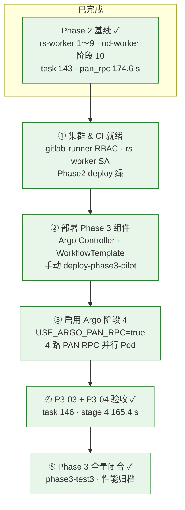

# Phase 3 运维手册（Argo Workflows — 阶段内并行）

> **状态（2026-06-23）**：**Phase 3 全量闭合** — 功能 task **144**；性能定稿 task **146** stage 4 **165.4 s**（优于 143 基线 174.6 s）。详见 [archives/2026-06-23_phase3-performance-closure.md](./archives/2026-06-23_phase3-performance-closure.md)。  
> **生产**：`SATELLITE_USE_ARGO_PAN_RPC=true`（**P3-04b**；P3-04c 已回退）。  
> **前置**：[PHASE2_RUNBOOK.md](./PHASE2_RUNBOOK.md)（Phase 2 已闭合；task **143** 基线 174.6 s）。  
> **架构**：[MICROSERVICES_IMPLEMENTATION_PLAN.md](./MICROSERVICES_IMPLEMENTATION_PLAN.md) §5 阶段 3。  
> **Argo 安装**：[k8s/phase3/argo/INSTALL_CHECKLIST.md](../k8s/phase3/argo/INSTALL_CHECKLIST.md)

## 实施路线图（Phase 2 → Phase 3 收口）




| 步骤 | 做什么 | 关键产出 |
|------|--------|----------|
| **① 集群就绪** | 一次性 RBAC + SA；Phase 2 CI 稳定 | rs-worker 正常 Running |
| **② 部署 Phase 3** | Argo + Template + rs-worker 集成（默认 Argo **关**） | `workflow-controller` Running |
| **③ 启用 Argo** | 打开 `USE_ARGO_PAN_RPC` | 阶段 4 走 4 并行 step Pod |
| **④ 验收** | 功能 + 性能（相对 143 不劣） | task 146 ✅；stage 4 **165.4 s** | ☑ |
| **⑤ 全量闭合** | benchmark + 归档 | [2026-06-23_phase3-performance-closure.md](./archives/2026-06-23_phase3-performance-closure.md) | ☑ |

> **当前位置**：Phase 3 已闭合；生产 **P3-04b**；stretch 目标 ≤131 s 留 Phase 4+。

---

## 1. 目标架构（Phase 3）

**Phase 2 现状**：rs-worker 进程内串行跑 1～9（阶段 4 PAN RPC 已在 Go 内 goroutine 分组，但仍在单 Pod 内）。

**Phase 3 增量**：用 **Argo Workflows** 把 **可并行阶段** 拆成 DAG Step Pod（Pilot 先做 **阶段 4 PAN RPC 4 路**），其余阶段仍由 rs-worker 驱动，**不推翻** Redis + od-worker 队列。

```text
backend ──rs.jobs──► rs-worker
                         │
                         ├─ 阶段 1～3、5～9（现有 runPython，不变）
                         │
                         └─ 阶段 4 PAN RPC ──► Argo Workflow（4 并行 step Pod）
                                    │
                                    └── 完成后 rs-worker 继续 5～9
                         │
                         └── od.jobs ──► od-worker（阶段 10，Phase 2 不变）
```

| 组件 | 职责 |
|------|------|
| `argo` namespace | workflow-controller（集群级） |
| `WorkflowTemplate` | `rs-pan-rpc-parallel`（4× `pan_rpc_warp_quarters.py`） |
| `rs-worker` | 创建/等待 Workflow；更新 DB stage 4 |
| `redis` / `od-worker` | **不变** |

**Pilot namespace**：继续 `gitlab-runner`（与 Phase 1/2 一致）；Controller 建议装 `argo` 全局 namespace。

---

## 2. 分步实施计划

| 步骤 | 内容 | 产出 | 状态 |
|------|------|------|------|
| **0** | 基线 | task **143** `pan_rpc` **174.6 s**（`phase2-test3/report.txt`）；task 141 为历史 **203.9 s** | ☑ |
| **1** | Argo 安装 + RBAC | [INSTALL_CHECKLIST.md](../k8s/phase3/argo/INSTALL_CHECKLIST.md) 全部勾选 | ☑ 集群已装 |
| **2** | WorkflowTemplate | `k8s/phase3/workflows/workflowtemplate-pan-rpc.yaml` | ☑ |
| **3** | rs-worker 集成 | `SATELLITE_USE_ARGO_PAN_RPC`；`internal/argo/` | ☑ 默认 false |
| **4** | CI | `deploy-phase3-pilot` job（manual） | ☑ |
| **5** | **P3-03 验收** | task 144 功能 ✅；stage 4 **212.7 s**（性能 ⚠️） | ☑ |
| **6** | 功能闭合 | [2026-06-22_phase3-closure.md](./archives/2026-06-22_phase3-closure.md) | ☑ |
| **7** | **P3-04 性能** | 相对 143 不劣；定稿 **146 / 165.4 s** | ☑ |
| **8** | 性能归档 | [2026-06-23_phase3-performance-closure.md](./archives/2026-06-23_phase3-performance-closure.md) | ☑ |

> 原 stretch 目标 **≤131 s** 未达；task 147（P3-04c）202.5 s 已回退。

### 当前状态

- **生产**：`USE_ARGO_PAN_RPC=true`，配置 **P3-04b**
- **定稿 benchmark**：`artifacts/benchmarks/phase3-test3/report.txt`（task 146）
- **回滚**：§4.4 `USE_ARGO_PAN_RPC=false`（Phase 2 进程内）

---

## 3. 步骤 1 — Argo 安装（摘要）

完整清单见 **[k8s/phase3/argo/INSTALL_CHECKLIST.md](../k8s/phase3/argo/INSTALL_CHECKLIST.md)**。

**首次部署前（k8s-master，root，一次性）**：

```bash
cd ~/code/satellite-cloud && git pull origin main
bash scripts/ops/install_argo_crds.sh
kubectl apply -f k8s/gitlab-runner-ci-rbac-phase3.yaml
kubectl apply -f k8s/phase1/rs-worker/serviceaccount.yaml
kubectl apply -f k8s/phase3/argo/rbac/gitlab-runner-workflow-submitter.yaml
kubectl apply -k k8s/phase3/argo/
kubectl apply -f k8s/phase3/argo/rbac/controller-clusterrole.yaml
kubectl apply -f k8s/phase3/argo/gitlab-runner-ci-rbac-argo-ns.yaml
kubectl apply -k k8s/phase3/
```

之后 GitLab CI `deploy-phase2-pilot` / `deploy-phase3-pilot` 方可正常 apply。

```bash
# 238：镜像入 Harbor
bash scripts/ops/mirror_argo_workflows_images.sh

# CI 或手动：controller + template
kubectl apply -k k8s/phase3/argo/
kubectl apply -k k8s/phase3/

# 验收
kubectl -n argo get deploy,pod
kubectl get crd workflows.argoproj.io workflowtemplates.argoproj.io
```

---

## 4. 步骤 2～3 — Workflow 与 rs-worker（已合入）

### 4.1 路径

| 路径 | 说明 |
|------|------|
| `k8s/phase3/workflows/workflowtemplate-pan-rpc.yaml` | 4 路并行 PAN RPC |
| `backend/internal/argo/client.go` | 提交 / 等待 Workflow |
| `backend/internal/remotesensing/pan_rpc_argo.go` | 同步 pan_rad → NFS、合并产物 |

Argo step Pod 读 **NFS** 上 `persist_output_preprocessing/pan_rad_toa`（rs-worker 提交前从 scratch 同步）。

### 4.2 环境变量（rs-worker）

| 变量 | 默认 | 说明 |
|------|------|------|
| `SATELLITE_USE_ARGO_PAN_RPC` | `false` | `true` 时阶段 4 走 Argo |
| `SATELLITE_ARGO_NAMESPACE` | `gitlab-runner` | Workflow 提交 namespace |
| `SATELLITE_ARGO_PAN_RPC_TEMPLATE` | `rs-pan-rpc-parallel` | WorkflowTemplate 名 |
| `SATELLITE_RS_WORKFLOW_IMAGE` | backend 镜像 | 与 rs-worker 同 SHA |

### 4.3 启用（P3-03 前，默认 false）

```bash
kubectl -n gitlab-runner set env deployment/rs-worker \
  SATELLITE_USE_ARGO_PAN_RPC=true \
  SATELLITE_RS_WORKFLOW_IMAGE=192.168.10.238/satellite/backend:<SHA>
kubectl -n gitlab-runner rollout status deployment/rs-worker
```

### 4.4 回滚

```bash
kubectl apply -k k8s/phase1/   # rs-worker env USE_ARGO_PAN_RPC=false
# 不删除 argo namespace；仅关闭调用
```

---

## 5. 步骤 4 — CI

```text
build-backend → deploy → deploy-phase2-pilot（自动）
deploy-phase3-pilot（manual，需时点击）
```

`deploy-phase3-pilot` 建议在 `deploy-phase2-pilot` 绿了之后手动触发（Argo / WorkflowTemplate / Argo RBAC + rs-worker Phase 3 env）。

```yaml
# .gitlab-ci.yml — deploy-phase3-pilot（manual）
deploy-phase3-pilot:
  when: manual
  needs:
    - deploy-phase2-pilot
```

---

## 6. 验收（P3-03）

### 6.1 功能

提交 **1 条 GF2 + 检测**（与 Phase 2 相同输入）：

```bash
TASK_ID=<id>
kubectl -n gitlab-runner get workflow -l satellite.io/task-id=$TASK_ID
kubectl -n gitlab-runner logs deploy/rs-worker --since=2h | grep -E "$TASK_ID|Workflow|pan_rpc"
# od-worker / 10 阶段仍应 success（Phase 2 路径不变）
```

| 项 | 通过标准 |
|----|----------|
| Argo | Workflow **Succeeded**；4 个 PAN RPC step（4×1 并行）均完成 |
| rs-worker | stage 4 由 Argo 驱动；**无** 进程内 680s 级 pan_rpc 日志块 |
| 端到端 | 10 阶段 completed；前端正常 |
| **性能** | stage 4 墙钟 **≤ 131 s**（相对 task 143 基线 174.6 s ↓25%）；保守线 **≤ 152 s**（相对 task 141 203.9 s） |

### 6.2 Benchmark 记录

```bash
# 集群侧（与 phase2-test1 同格式）
artifacts/benchmarks/phase3-test1/report.txt
```

---

## 7. P3-04 性能优化（定稿 P3-04b）

| task | 配置 | stage 4 | 结果 |
|------|------|---------|------|
| 144 | init-dirs + NFS sync | 212.7 s | 功能基线 |
| 145 | 2×2 分组 | 285.5 s | ❌ 回退 |
| **146** | **P3-04b** | **165.4 s** | **✅ 生产定稿** |
| 147 | P3-04c 直写+亲和 | 202.5 s | ❌ 回退 |

**P3-04b 固化**：

| 优化 | 说明 |
|------|------|
| 阶段 3 直写 persist | 无 scratch→NFS 同步 |
| 无 init-dirs | rs-worker 预建 `workers/group{1..4}` |
| persist merge | rename 合并 part 文件 |
| 4×1 并行 | area1～4；4 CPU step |

**部署 / 回退 P3-04c 后**：

```bash
kubectl apply -k k8s/phase3/
kubectl -n gitlab-runner rollout restart deploy/rs-worker   # 新 P3-04b backend 镜像后
```

完整归档：[2026-06-23_phase3-performance-closure.md](./archives/2026-06-23_phase3-performance-closure.md)

**Workflow Pod 节点**（`.status.nodes`）：

```bash
WF=$(kubectl -n gitlab-runner get workflow -l satellite.io/task-id=<ID> -o jsonpath='{.items[0].metadata.name}')
kubectl -n gitlab-runner get workflow "$WF" -o json | jq -r '
  .status | "workflow: \(.startedAt) -> \(.finishedAt)",
  (.nodes | to_entries[] | select(.value.type=="Pod") |
    "\(.value.displayName)\t\(.value.startedAt)\t\(.value.finishedAt)\t\(.value.hostNodeName // "-")")'
```

---

## 8. 故障排查

| 现象 | 处理 |
|------|------|
| Workflow Pending | 查 workflow-controller；节点资源；PVC mount |
| step Pod ImagePullBackOff | Harbor 补 backend / argoexec 镜像 |
| step 无 NFS 写权限 | 对齐 rs-worker volumeMount；init 目录 chmod |
| rs-worker 不提交 Workflow | `USE_ARGO_PAN_RPC`；RBAC（见安装清单 §5） |
| stage 4 变慢 | 查 4 step 是否真并行；节点 CPU 争抢；`parallelism` |

---

## 9. 相关路径

| 路径 | 说明 |
|------|------|
| [k8s/phase3/argo/INSTALL_CHECKLIST.md](../k8s/phase3/argo/INSTALL_CHECKLIST.md) | Argo 安装清单 |
| [k8s/phase3/argo/](../k8s/phase3/argo/) | Controller 清单（待增） |
| [scripts/ops/mirror_argo_workflows_images.sh](../scripts/ops/mirror_argo_workflows_images.sh) | 镜像推 Harbor |
| [MICROSERVICES_IMPLEMENTATION_PLAN.md](./MICROSERVICES_IMPLEMENTATION_PLAN.md) §5 阶段 3 | 方案 SSOT |

---

## 10. 不在 Phase 3 范围

- 全 10 阶段 Argo 化（后续扩展）
- 替换 Redis 队列
- GPU / MinIO / 120 星（Phase 2+ / 5 / 6）

*本文件随实施更新；收口后摘要进 `docs/archives/`。*
